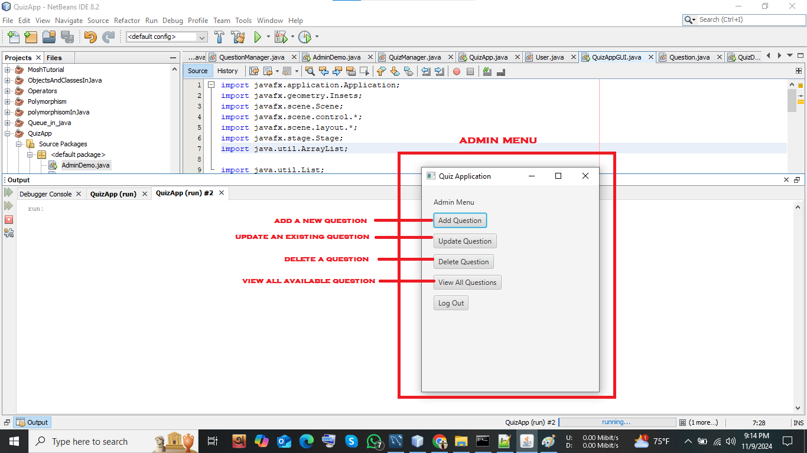

# Quiz App Project

A Java-based quiz application that allows users to take quizzes on various topics, including MySQL, database management, and other technical topics. This project is a simple but fully functional quiz system with a Graphical User Interface (GUI) built using JavaFX and a backend database (MySQL) to store questions, users, and quiz attempt data.

---

## Table of Contents

- [Features](#features)
- [Project Structure](#project-structure)
- [Design and Architecture](#design-and-architecture)
- [Database Schema](#database-schema)
- [Installation and Setup](#installation-and-setup)
- [Usage](#usage)
- [Screenshots](#screenshots)
- [License](#license)

---

## Features

1. **User Authentication**:
   - User login and registration system with different roles (`user` and `admin`).
   
2. **Admin Functions**:
   - Add, update, and delete quiz questions.
   - View all questions in the database in a scrollable layout.
   - View user quiz attempts and scores.

3. **Quiz Functionality**:
   - Users can select the number of questions for each quiz session.
   - Questions are randomly selected and displayed one by one.
   - Submit quiz results to view the score and compare it to the total number of questions.

4. **Database Integration**:
   - Stores questions, user credentials, and quiz attempts in a MySQL database.

5. **Error Handling**:
   - Input validation for question fields, answers, and number of questions for quizzes.

---

## Project Structure

- **DBConnection**: Handles MySQL database connection setup.
- **QuestionManager**: Manages question operations (CRUD operations).
- **QuizManager**: Manages quiz functionality, including loading questions and scoring.
- **UserManager**: Manages user registration, authentication, and role management.
- **QuizAppGUI**: Main GUI class that controls the scenes, navigation, and user interactions.

---

## Design and Architecture

The project is designed with a modular architecture where each functionality is encapsulated in separate classes:
- **Database Layer**: Provides a MySQL-based persistence layer with `DBConnection` managing connections.
- **Business Logic Layer**: Classes like `QuestionManager`, `QuizManager`, and `UserManager` handle the core logic of the application.
- **Presentation Layer**: `QuizAppGUI` handles the GUI interactions and displays the scenes for user and admin actions.

---

## Database Schema

The application uses a MySQL database named `quizdb` with the following schema:

- **`users` Table**: Stores user information, including username, password, and role.
- **`questions` Table**: Stores question details, including options and the correct answer.
- **`quiz_attempts` Table**: Logs quiz attempt details for each user, including score and time taken.

```sql
CREATE DATABASE quizdb;
USE quizdb;

CREATE TABLE users (
    user_id INT AUTO_INCREMENT PRIMARY KEY,
    username VARCHAR(50) NOT NULL UNIQUE,
    password VARCHAR(255) NOT NULL, 
    role ENUM('user', 'admin') NOT NULL
);

CREATE TABLE questions (
    question_id INT AUTO_INCREMENT PRIMARY KEY,
    question_text TEXT NOT NULL,
    option_1 VARCHAR(255) NOT NULL,
    option_2 VARCHAR(255) NOT NULL,
    option_3 VARCHAR(255) NOT NULL,
    option_4 VARCHAR(255) NOT NULL,
    correct_option INT NOT NULL CHECK (correct_option BETWEEN 1 AND 4),
    created_by INT,
    FOREIGN KEY (created_by) REFERENCES users(user_id)
);

CREATE TABLE quiz_attempts (
    attempt_id INT AUTO_INCREMENT PRIMARY KEY,
    user_id INT,
    score INT,
    attempted_on TIMESTAMP DEFAULT CURRENT_TIMESTAMP,
    time_taken INT,
    FOREIGN KEY (user_id) REFERENCES users(user_id)
);
```
---
## Usage
After running the project, you can:

- Login as a user to take quizzes.
- Login as an admin to manage questions, view quiz results, etc.
- Follow the on-screen instructions to complete quizzes and view your score.
---
## Screenshots
Here’s a screenshot of the app in action:





---
## Notice

This app can be used as the foundation for building a complete, fully functional quiz application. The current version includes essential features like quiz management, user authentication, and a basic question management system. You can extend it further with additional features such as time limits, quiz categories, progress tracking, and more.

Feel free to fork this repository and modify it according to your requirements.

